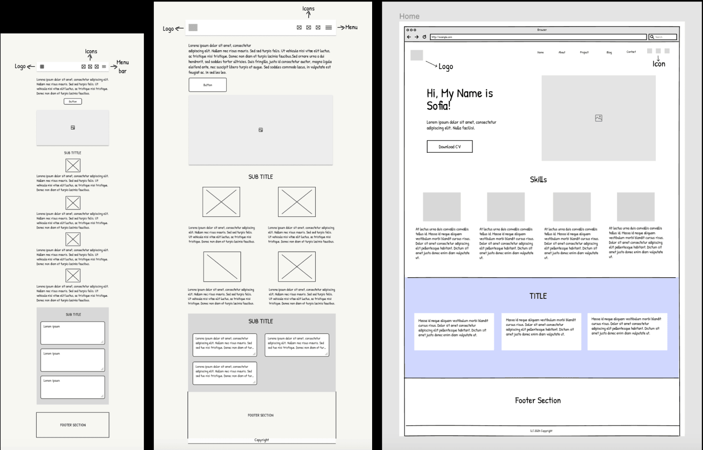
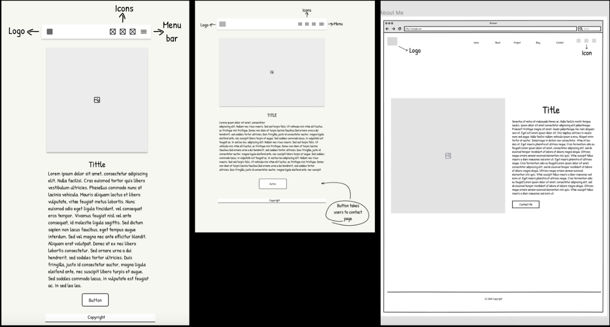
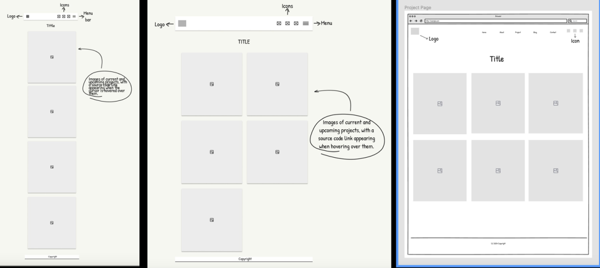
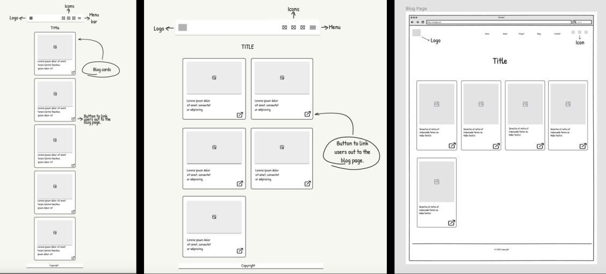
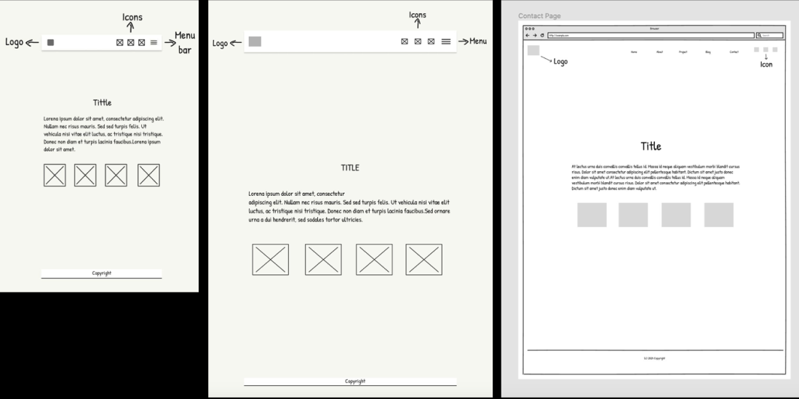

# T1A2_Portfolio_Website

## Description

### **Purpose and Target Audience**

This portfolio website was crafted to showcase the skills acquired during my time at Coder Academy, providing an overview of my current skillset and UX knowledge It serves as a professional personal platform to exhibit my expertise and capabilities in web development to potential employers after I finish studying. My target audience includes potential employers, recruiters, and anyone interested in learning more about my background and capabilities.

### **Sitemap**

### **Wireframes**

- Homepage Wireframe 

- About Wireframe 

- Project Wireframe 

- Blog Wireframe 

- Contact Wireframe 

### **Wireframes**

- Homepage Wireframe 

