# T1A2 - Portfolio Website

## Links

### [Live Website](https://fancy-donut-3b2c0d.netlify.app) 
### [GitHub Repository](https://github.com/sooffia/T1A2_Portfolio_Website)
### [Video Presentation](https://youtu.be/Q6t_Bz5B1Kg) 

## Description

### **Purpose and Target Audience**

This portfolio website serves as a showcase of the skills I've honed during my time at Coder Academy, giving a glimpse into my capabilities in web development and grasp of UX principles. It's designed as a personalized platform to highlight my proficiency in web development to future employers after I complete my education. The target audience includes potential employers, recruiters, and anyone interested in delving deeper into my background and skills.

### **Functionality & features**

- Flexbox positioning is extensively used across the website, complemented by media queries to ensure responsiveness across various devices. 
- Grid layouts was used in the home page to create organized and visually appealing content arrangements.
- JavaScript functionality is used to transform the navigation menu into a dropdown menu (id="menu") on smaller screens like phones and tablets, improving navigation usability on mobile devices. 
- Semantic HTML elements are used throughout the website, and descriptive alt text is included for images to ensure accessibility for users who rely on screen readers.
- A custom colour scheme was used to allow for easy colour management across the website, enhancing its visual apearance. 
- The website features a uniform footer design that adjusts its positioning based on the device used to view the site.
- Hover animations are incorporated to provide simple interactive features on buttons and links, increasing user engagement and interactivity.

### **Sitemap**

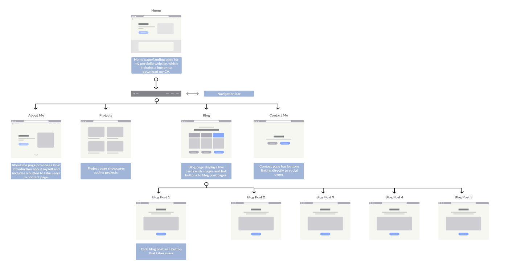

Users will view the following: 
 -  Experience and skills
 -  Resume
 -  Career goals 
 -  Portfolio Projects
 -  Blogs
 -  Contact details 

### **Wireframes**

- Homepage Wireframe 
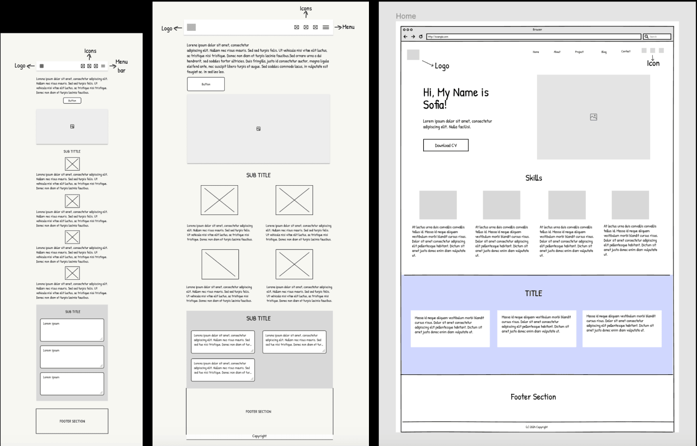

- About Wireframe 
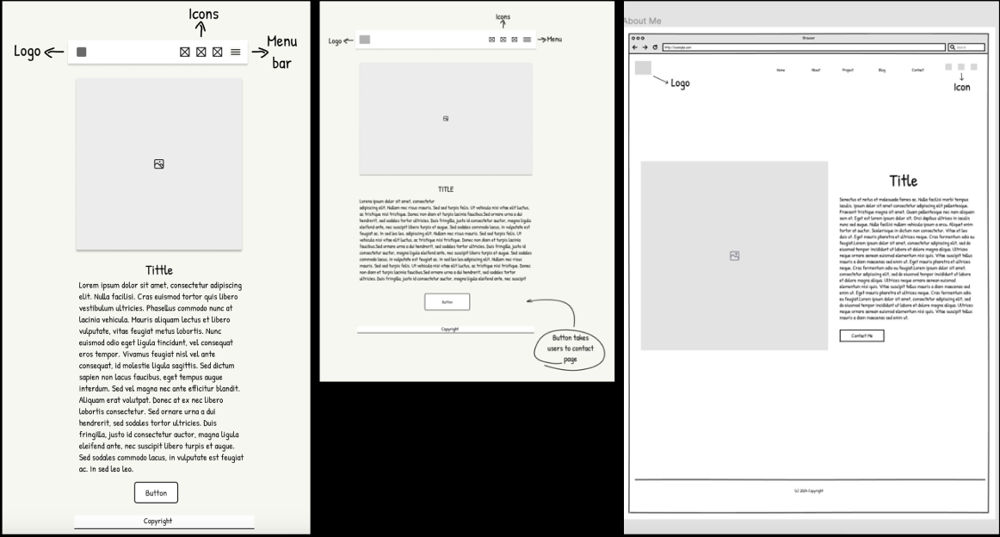

- Project Wireframe 
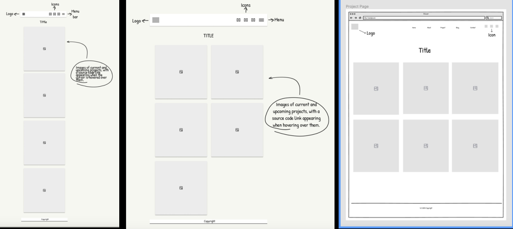

- Blog Wireframe 
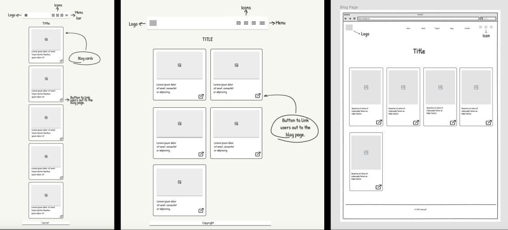

- Contact Wireframe 
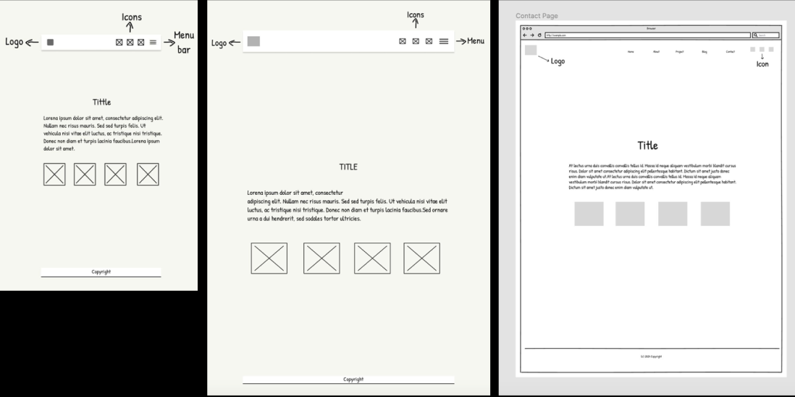

### **Screenshots**

- Homepage Screenshot 
 
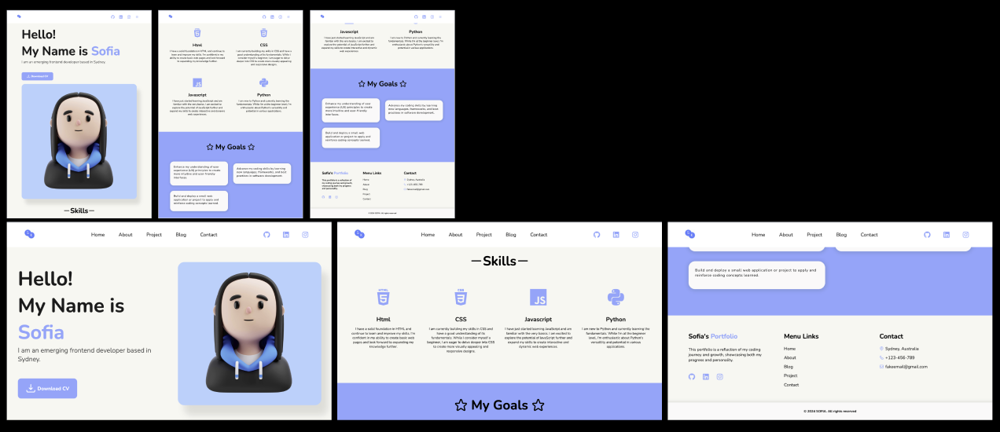

- About Screenshot
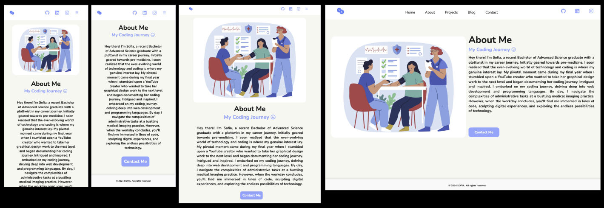

- Project Screenshot
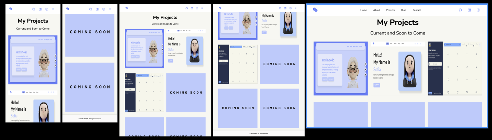

- Blog Screenshot
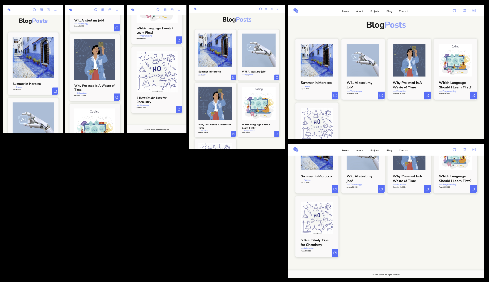

- Blog Page Screenshot
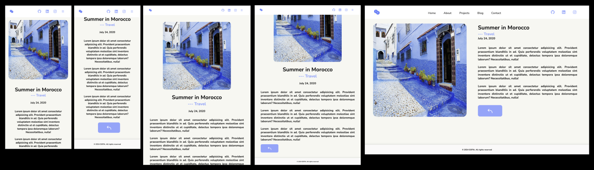

- Contact Screenshot
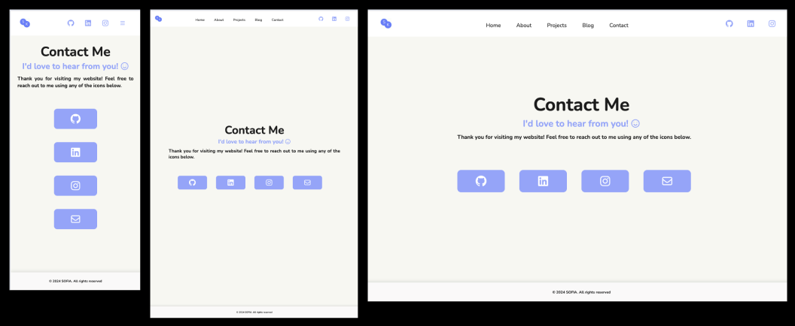

### **Techstack**
- HTML
- CSS
- Javascript 
- Vscode
- Akar icons - icon library 
- Figma - sitemap and wireframes 
- Netlify - deployment 

